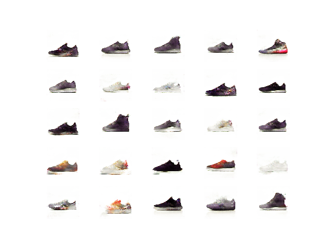

# Sneaker Generation using Generative Adversarial Networks

Try the demo at: https://huggingface.co/spaces/adit-desai/gans-sneakers

### Deep Convolutional GAN (DCGAN)

### Wasserstein GAN with gradient penalty (WGAN GP)

### Conditional GAN (cGAN)
Black:

Blue:

Red:

Tan:

White:

